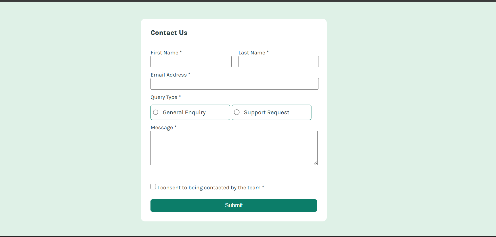

📌 Overview
✅ The challenge

Users should be able to:

Complete the form and see a custom success toast message after submission

Receive validation messages if:

Required fields are empty

Email format is invalid

Navigate and complete the form using keyboard only

Hear input, error, and success message announcements via screen readers

See responsive layout across all devices

See clean hover and focus states on all interactive elements

🖼️ Screenshot

🔗 Links

Solution URL: https://your-solution-url.com

Live Site URL: https://your-live-site-url.com

(Replace these links with your actual URLs.)

🛠️ My Process
🚀 Built with

Semantic HTML5

CSS3 custom properties

Flexbox

Responsive design / Mobile-first workflow

Vanilla JavaScript (for validation & success alert animation)

📚 What I learned

This project helped me practice:

Building fully custom form validation without libraries

Using .nextElementSibling and DOM traversal for error messages

Creating a sliding top success alert with CSS transitions

Improving accessibility with proper labels and states

Structuring clean, reusable CSS with variables

Example: Custom alert animation
function showTopAlert() {
  const alertBox = document.getElementById("topAlert");
  alertBox.style.top = "20px";

  setTimeout(() => {
    alertBox.style.top = "-120px";
  }, 3000);
}

Example: Error handling pattern
if (fname.value.trim() === "") {
  fname.nextElementSibling.textContent = "This field is required";
  valid = false;
}

🔄 Continued development

In future projects, I want to:

Improve accessibility using ARIA live regions

Add animated SVG checkmarks

Explore reusable form-validation utilities

Build backend integration using Node.js or Firebase

📌 Useful resources

https://developer.mozilla.org/
 – Best reference for HTML, CSS, and JS

https://www.frontendmentor.io/resources
 – Helpful tools and patterns

CSS Transitions Guide – https://css-tricks.com/almanac/properties/t/transition/

👤 Author

Frontend Mentor – @Khaisar-tech

GitHub – @Khaisar-tech

